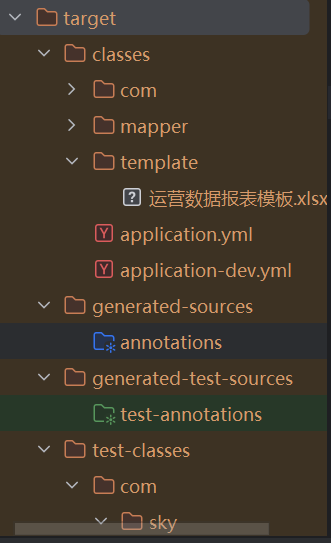

# ApachePOI学习笔记（苍穹外卖）
## 如何让浏览器下载文件？
在后端实现让前端通过请求直接下载文件（如Excel报表），可以使用 ServletOutputStream将文件流写入HTTP响应
```java
//相关代码
```
```java
    InputStream inputStream = this.getClass().getClassLoader().getResourceAsStream("template/运营数据报表模板.xlsx");
```
#### 作用：
​​通过Java的Apache POI库从项目的资源目录（classpath）中加载一个Excel模板文件​​
#### 原理
java读取文件是默认从Java根目录开始读，所以要加上getClassLoader获取类加载器，也就是让它从资源目录resource下开始读取

通过Maven/Gradle的构建机制，将src/main/resources下的文件复制到target/classes（或build/resources/main）中，并​​保持相同的相对路径结构​​。

功能拆解：
1. **`getClass().getClassLoader()`**  
   - 作用：获取当前类的类加载器。  
   - 用途：用于从类路径（`src/main/resources`或打包后的JAR内）加载资源文件。

2. **`getResourceAsStream("template/运营数据报表模板")`**  
   - 作用：从类路径的`template`目录读取文件，返回`InputStream`。  
   - 关键说明：  
     - 路径格式为 `"目录/文件名"`（无文件后缀，需确保实际文件存在且后缀如`.xlsx`正确）。  
     - 文件需位于类路径下（如`src/main/resources/template/`）。

3. **`try { ... }`**  
   - 后续操作（推测）：
